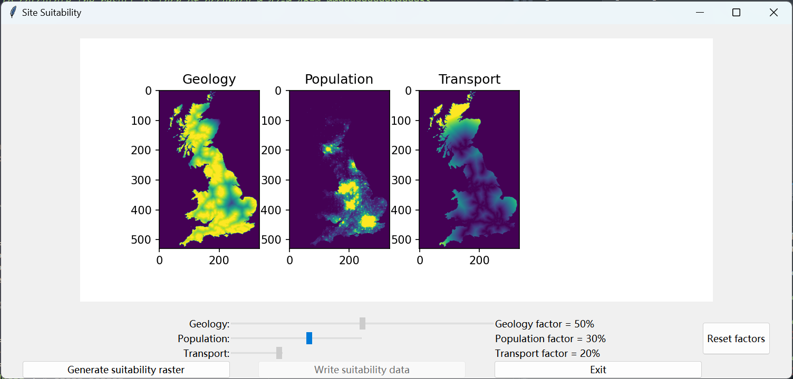
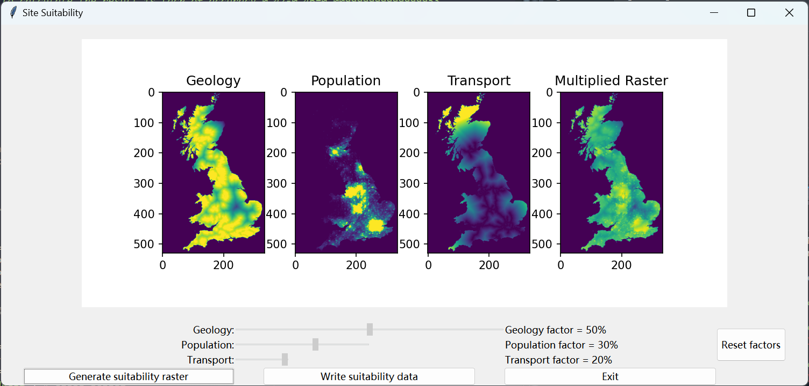
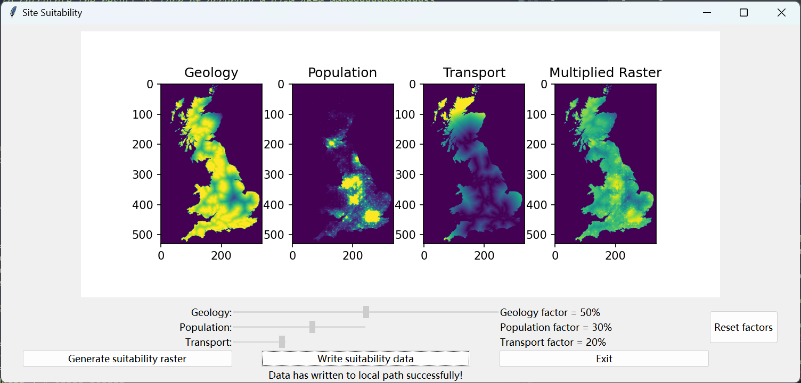

<!--README-->
###### readme top
<!-- PROJECT LOGO -->
<br />
<div align="center">
  <a href="https://github.com/LiuqianC/Site_suitability">
    
  </a>

  <h3 align="center">Site Suitability</h3>

  <p align="center">
    A software to easily choose the factor weights and visualise the suitability!
</div>

<!-- TABLE OF CONTENTS -->
<details>
  <summary>Table of Contents</summary>
  <ol>
    <li>
      <a href="#about-the-project">About The Project</a>
      <ul>
        <li><a href="#built-with">Built With</a></li>
      </ul>
    </li>
    <li>
      <a href="#getting-started">Getting Started</a>
      <ul>
        <li><a href="#prerequisites">Prerequisites</a></li>
        <li><a href="#installation">Installation</a></li>
        <li><a href="#run">Run</a></li>
      </ul>
    </li>
    <li><a href="#usage">Usage</a></li>
    <ul>
        <li><a href="#interface">Interface</a></li>
        <li><a href="#process-of-use">Process of use</a></li>
        <li><a href="#a-usage-example">A usage example</a></li>
      </ul>
    <li><a href="#code-details">Code Details</a></li>
    <li><a href="#license">License</a></li>
    <li><a href="#contact">Contact</a></li>
    <li><a href="#acknowledgments">Acknowledgments</a></li>
  </ol>
</details>


<!-- ABOUT THE PROJECT -->
## About The Project
This is the Site Suitability project for assignment 2.

The project provides a software that automatically calculates site suitability. The three most important factors in the siting of companies for rock aggregates are geology, transport and population. The importance of these three factors may vary from one situation to another, so the weights of the three factors need to be constantly adjusted. Each of the three factors is multiplied by its own weight and added together to derive the site suitability. Using this software, the user can easily select the factor weights using the sliders and visualise the final calculated suitability.

<p align="right">(<a href="#readme-top">back to top</a>)</p>

### Built With

The following are the main libraries used for the project.

* [![Matplotlib][Matplotlib-logo]][Matplotlib-url]
* [![Tkinter][Tkinter-logo]][Tkinter-url]

<p align="right">(<a href="#readme-top">back to top</a>)</p>

### Folder structure
- InputData
	- geology.txt: The factor raster data of geology
	- population.txt: The factor raster data of population
	- transport.txt: The factor raster data of transport
- OutputData: Two example resulting images and example raster txt format data
- Readme: Prepared images for readme
- TestData
	- TestReport.txt: The running result shown in the console
	- test.py: The test code containing 6 unittest cases
		- `class TestIO`
			- `test_read_data`: A test case for the function which reads data from local
			- `test_write_data`: A test case for the function which writes data to local
		- `class TestGeometry`
			- `test_mul`: A test case for the function which multiplies the factor data by their weights respectively and adds them up
			- `test_get_rows_cols`: A test case for the function which gets the rows number and columns number of the input rasters
			- `test_get_max_min`: A test case for the function which gets the maximum value and the minimum value of a raster data list
			- `test_rescale`: A test case for the function which rescales a raster list to (0, 255)
- modules:
	- geometry.py: The functions used in calculations
		- `def multiply(data1, factor1, data2, factor2, data3, factor3)`: Multiplies all raster data by their factor weights and adds them up
		- `def get_rows_cols(data)`: Gets the rows number and columns number of the raster data by searching row by row and column by column
		- `def get_max_min(data)`: Gets the maximum value and the minimum value of the raster data by searching row by row and column by column
		- `def rescale(data)`: Rescales the raster data to (0, 255)
	- io.py: The functions used to read data and write data
		- `def read_data(filename)`: Reads the txt file into the environment according to the filename
		- `def write_data(filename,data)`: Writes the raster data in the environment to local according to the filename
- Lisence: the MIT lisence
- Readme.md: The readme content in Markdown language
- **model.py: The main running code**

<!-- GETTING STARTED -->
## Getting Started

The purpose of this project is to visualise the site suitability.

### Prerequisites

The software is built based on Python environment. 
 
Before you can use this software, you need to install the following python library in CMD window:
* matplotlib
	  ```
	  pip install matplotlib
	  ```

### Installation

Clone the repo
	   ```
	   git clone https://github.com/LiuqianC/Site_suitability.git
	   ```

### Run

Run ``` model.py ```
- Open  ```model.py``` in any Python compiler and Run.
- Run it in CMD window:
	   ```
	   cd 'THE GIT REPOSITORIES PATH'
	   python model.py
	   ```
   
<p align="right">(<a href="#readme-top">back to top</a>)</p>

<!-- USAGE EXAMPLES -->
## Usage

### Interface

The interface contains 3 types of control components:
* Canvas
All the images will shown on the canvas. It contains 3 factors images initially, and will add a suitability image when generating the site suitablity.

* Sliders
The slider controls the weight of the factor in the final suitability result. There are 3 sliders in the interface, which control the weight of factor respectively. 

* Buttons
The buttons enable reset factor weights, image generation, write data and exit functions.

### Process of use

1. Set factors weight. 
Initially, the user can only move the first slider and the other sliders are disabled. Once the first slider has moved, the state of the second slider becomes normal and can be moved and the length of the second slider will change corresponding to the first weight. The third slider will move automatically when moving the second one.

2. Generate the site suitability
Once the weights of 3 factors are decided, the user can press the 'Generate suitability raster' button to calculate the site suitability. The final calculated result raster will appear on the canvas near 3 factor images.

3. Write data
The 'Write suitability data' button is disabled initially. It will be normalOnce the result raster has been calculated, the 'Write suitability data' button will become normal and can be used. When the user click the button, the calculated site suitability will be downloaded to your local PC in txt format. Once the user click the output button, a sentence will appear behind the button indicating the output is successful or not.

4. Reset factors weight
If the weight are not perfect, the user can press ‘Reset factors’ button to reset.  

###  A usage example
1. Open the initial interface:
Now the second slider, the third slider and write data button are disabled. 


2. Change the weight of factors:
First, the user need to decide the geology factor's weight. When the user start to move the population slider, the geology slider will be locked. The transport slider will move automatically as the change of population to keep the sum of three weights equal to 1.


3. Generate the site suitability image:
When the weights are determined, the final result raster is calculated once the 'Generate' button is clicked. The raster is shown on the canvas. At this time, the data is ready to output, so the 'Write' button can be used now.


4. Write the result data
The user can click the 'Write' button to download the result data to local. Once the  output is successful, there is a line showing the success.


5. Reset the weight
If the weight of factors should be edited, the user should click the 'Reset' button. Once the button is clicked, the silders comes back to the initial states. The user can move the first slider again. At this time, the 'Write' button is disabled to prevent an incorrect output raster. After generating the new result raster, the 'Write' button return to normal.


<p align="right">(<a href="#readme-top">back to top</a>)</p>
      
<!-- code details -->
## Code details
### Data introduction
The three factor raster data are all two dimensional raster data for each factor with values in the range [0, 255]. The higher the value of a factor, the more suitable the location is for the factory.
- [x] Geology
- [x] Population
- [x] Transport

### Idea 

Each factor is to be multiplied by a weight and the weighted factors are to be added up to give an overall suitability for each raster location. The multiplied resulting raster is rescaled to have values in the range [0, 255]. The rescaled resulting raster is shown on the GUI and downloaded to user's local in txt format. 

### Main structure
1. Import packages
2. Read three factor rasters
3. Create GUI
	- Create tkinter window
	- Create control conponents
4. Plot 3 factor images in GUI
5. Start the GUI

### Functions
1. Multiply
2. Rescale
3. Output

<p align="right">(<a href="#readme-top">back to top</a>)</p>

<!-- LICENSE -->
## License

Distributed under the MIT License. See `License` for more information.

<p align="right">(<a href="#readme-top">back to top</a>)</p>

<!-- CONTACT -->
## Contact

Liuqian Chen -  geochenliuqian@gmail.com

Project Link: [[LiuqianC/Site_suitability](https://github.com/LiuqianC/Site_suitability)]

<p align="right">(<a href="#readme-top">back to top</a>)</p>


<!-- ACKNOWLEDGMENTS -->
## Acknowledgments

* [ README template (github.com)](https://github.com/othneildrew/Best-README-Template)


<p align="right">(<a href="#readme-top">back to top</a>)</p>


<!-- MARKDOWN LINKS & IMAGES -->
<!-- https://www.markdownguide.org/basic-syntax/#reference-style-links -->
[Matplotlib-logo]: https://matplotlib.org/stable/_static/logo2_compressed.svg  
[Matplotlib-url]: https://matplotlib.org/stable/index.html
[Tkinter-logo]:https://www.python.org/static/img/python-logo@2x.png
[Tkinter-url]:https://docs.python.org/3/library/tkinter.html